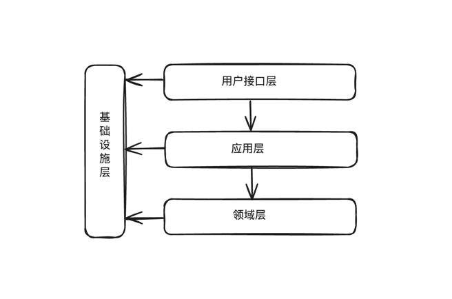

# java-template-ddd

该模板是基于 [go-template-ddd](https://github.com/ihezebin/go-template-ddd) 项目的 JAVA 实现。

## 已集成组件

- dto 绑定
- 统一响应体
- 全局异常处理
- traceId 传递
- 日志文件滚动
- 请求参数和响应体日志
- 跨域
- 自定义配置文件
- MySQL migration 和 mapper

# go-template-ddd

参考：

- [美团 DDD 实践](https://tech.meituan.com/2017/12/22/ddd-in-practice.html)
- [DDD 靠谱吗](https://www.zhihu.com/question/328870859)
- [一文看懂 DDD 领域驱动设计](https://zhuanlan.zhihu.com/p/347603268)
- [DDD 领域驱动设计实战-分层架构及代码目录结构](https://blog.csdn.net/qq_33589510/article/details/108991348?utm_source=app&app_version=4.15.0&code=app_1562916241&uLinkId=usr1mkqgl919blen)
- [DDD（领域驱动设计）总结](https://blog.csdn.net/woshihyykk/article/details/108538608?utm_source=app&app_version=4.15.0&code=app_1562916241&uLinkId=usr1mkqgl919blen)
- [聊聊 golang 的 DDD 项目结构
  ](https://segmentfault.com/a/1190000039397677)

## 1.简述

基于 DDD 架构的 Web 服务快速构建模板。

> DDD 领域驱动设计是一个很宽泛的方法论，涉及到的概念也很多，DDD 并没有给出标准的代码模型，不同的人可能会有不同理解。
>
> 该模板项目尝试通过不断的理解领域驱动，结合 DDD 的思想和规范，构建出一个 Go 代码项目目录结构，将 DDD 落地。

## 2.DDD 分层架构

分层架构有一个重要的原则：每层只能与位于其下方的层发生耦合。具体又可以分为：严格分层架构和松散分层架构。

- 严格分层架构：某层只能与直接位于其下方的层发生耦合；
- 松散分层架构：允许任意上方层与任意下方层发生耦合。

严格分层，自然是最理想化的，但这样肯定会导致大量繁琐的适配代码出现，故在严格与松散之间，一般追寻和把握一下平衡。

DDD 包含 4 层，将领域模型和业务逻辑分离出来，并减少对基础设施、用户界面甚至应用层逻辑的依赖，因为它们不属业务逻辑。将一个复杂 的系统分为不同的层，每层都应该具有良好的内聚性，并且只依赖于比其自身更低的层。



### 2.1 用户接口层

该层在基于 Gin 框架的实践中，我更偏向于将其命名为路由层，因为 GIN 处理了这层的绝大部分逻辑。这层一般包括如下内容：

- Web 服务和中间件
- 对外暴露的 API 接口，接受用户或者外部系统的请求，响应必要的数据信息
- 数据安全性校验，比如：id 不为空，手机号为 11 位等

用户接口层我将其命名为`server`，因为我觉得它包含了构建一个 Web 服务的大部分内容，以此命名更容易让人一看到就知道这是微服务的入口，目录结构如下：

```
.
├─server          # 用户接口层
│  ├─router       # 路由
│  ├─middleware   # 中间件，如CROS，认证拦截器，过滤器等
│  └─swagger      # API 文档
.
```

### 2.2 应用层

应用层关心处理完一个完整的业务逻辑，该层只负责业务编排，对象转换，实际业务逻辑由领域层完成。应用层不关心【请求从何处来】，但是关心【谁来做、做什么、有没有权限做】。该层非常适合处理事务，日志和安全等。相对于领域层，应用层应该是很薄的一层。它只是协调领域层对象执行实际的工作。

另外由于严格按照自上到下的依赖关系，应用层中通常也会用到用户接口层中常用数据传输对象，所以 dto 我放这层：

```
.
├─application # 应用层
│  ├─dto # DTO数据传输对象，根据不同传输数据类型，还可以在dto下建子目录如：restful、protobuf 分别表示restful api 和 grpc 的传输数据对象等
│  └─service
.
```

> 这一层的目录我趋向于让其简洁一点，直接调用领域层或基础设施层的相关处理即可。

### 2.3 领域层

领域层主要包含聚合根、实体、值对象、领域服务等领域模型中的领域对象；领域层主要负责表达业务概念，业务状态信息和业务规则。领域层是整个系统的核心层，几乎全部的业务逻辑会在该层实现。领域模型层主要包含以下的内容：

- 实体(Entities):具有唯一标识的对象, 如：商品
- 值对象(Value Objects): 无需唯一标识, 如：商品快照
- 领域服务(Domain): 与业务逻辑相关的，具有属性和行为的对象
- 聚合/聚合根(Aggregates & Aggregate Roots): 聚合是指一组具有内聚关系的相关对象的集合
- 仓储(Repository): 提供持久化数据和操作数据库的方法

```
.
├─domain         # 领域层
│  ├─entity      # 实体
|  ├─vo          # 值对象
│  ├─repository  # 仓储
│  └─service     # 服务OR聚合
.
```

> 这里比较特殊的是`service`，我将`service`理解为当处理单一实体甚至聚合不能很好解决的场景时，为了保持实体本身自己的内聚，此时才新建`service`做处理；domain service 也是被 application service 编排的一部分。

### 2.4 基础设施层

基础设施层为上面各层提供通用的技术能力：为应用层传递消息，为领域层提供持久化机制，为用户界面层提供通用组件等。基础设施层以不同的方式支持所有三个层，促进层之间的通信。

```
.
├─component
│  ├─cache
│  ├─doc
│  ├─pubsub
│  ├─storage
│  ├─constant
│  └─util
.
```

如果你不太确定某一部分组件属于那一层，那么我觉得你都可以将其放到基础设施层，因为该层支撑着其他三层，任何一层从该层使用某一组件，都是合理的，也是符合 DDD 思想的。

所以我也很自然的将其取名为`component`，这样很容易让我一眼就看出来这里放了支撑全局的各种通用组件或者工具。

通常数据库连接、缓存、日志、邮件发送、消息发布订阅等都是基础设施层的组件。

### 2.5 其他

对于一个 web 服务中的常用其他场景，如定时任务、消息发布订阅的处理等，我还新增了 config、script、cron 和 worker 包等，请根据需求自行添加。

```
./
├─worker
├─script
├─cron
```

注意，消息发布订阅的连接客户端在基础设施层，但具体的逻辑和实现在 worker 中异步处理。

## 3.校验决策

```bash
是否与对象自身状态直接相关？
├── 是 → 放在实体中
└── 否 →
    ├── 是否需要跨对象协作/外部资源？
    │   ├── 是 → 领域服务
    │   └── 否 →
    │       ├── 是否是纯格式校验？ → 应用层
    │       └── 是否是业务规则？ → 领域服务
    └── 是否涉及业务流程控制？ → 领域服务
```

关键区别示例

| 校验类型         | 归属位置 | 示例                         |
| ---------------- | -------- | ---------------------------- |
| 用户名非空       | 实体     | user.Name != ""              |
| 邮箱格式有效性   | 实体     | strings.Contains(email, "@") |
| 密码最小长度     | 应用层   | len(password) >= 8           |
| 邮箱唯一性       | 领域服务 | 通过仓储检查是否已存在       |
| 订单商品库存不足 | 领域服务 | 调用库存服务验证             |
| 身份证号校验算法 | 值对象   | 内嵌在 IDCard 值对象中       |

错误案例：在实体中直接调用仓储

```go
// ❌ 违反分层架构
type User struct {
    repo UserRepository // 错误：实体依赖仓储
}

func (u *User) ValidateUnique() error {
    existing, _ := u.repo.FindByEmail(u.Email)
    return existing != nil
}
```

正确方式：通过领域服务协调

```go
// ✅ 保持实体纯净
func (s *UserRegistrationService) Register(user *User) error {
    if exists, _ := s.repo.Exists(user.Email); exists {
        return ErrDuplicateEmail
    }
    // ...
}
```

## 4. 整体目录结构

```
./
├─application
│  ├─dto
│  └─service
├─cmd
├─component
│  ├─cache
│  ├─doc
│  ├─pubsub
│  ├─storage
│  ├─constant
│  └─util
├─config
├─domain
│  ├─entity
│  ├─repository
│  ├─vo
│  └─service
├─script
├─server
│  ├─handler
│  ├─middleware
│  └─swagger
├─migration
├─cron
└─worker
```

除了领域驱动中常见的四层目录，对于一个完整的项目，和一些常见的项目，我又补充了一些专门用于描述这部分需求和逻辑的目录：

```
./
├─cmd       # 命令行程序
├─config    # 配置文件
├─log       # 日志文件（通常只适用于本机调试时的日志输出）
├─script    # 脚本，如：数据库索引可以记录在一个index.js脚本文件中
├─static    # 静态资源文件，如：图片、excel文档等
└─worker    # 工作进程，包括独立部署的进程和集成在服务中的守护进程等，如：定期清理数据库软删除数据的定时器
```

## 5.实践简例

详细案例请自行查看模板项目代码。

## 6.编码风格

可以发现所有的包名都采用的单数形式，主要参考于该规范：<https://rakyll.org/style-packages/>

## 7.生成项目

从`https://github.com/ihezbien/project-create-quickly.git`中下载可执行程序`pcq`，执行下述命令，将自动拉取模版项目并初始化:

```bash
pcq -t go-ddd [项目名]
```

脚本已同时发布到 npm，在安装有 nodejs 的环境下，可以通过 npx 使用:

```bash
npx pqc -t go-ddd test
```

然后初始化为 git 仓库，并自行关联远程仓库即可：

```bash
git init
```

Example：

```bash
hezebin@ ~ pcq -t go github.com/ihezbien/test

Project name: test, Mod name: github.com/ihezbien/test

Generating project Success!

Organizing project files...
[Success]  test/.gitignore
[Success]  test/README.md
[Success]  test/application/test.go
[Success]  test/cmd/root.go
[Success]  test/component/cache/memory.go
[Success]  test/component/cache/redis.go
[Success]  test/component/constant/commom.go
[Success]  test/component/doc/doc.go
[Success]  test/component/doc/swagger.json
[Success]  test/component/mail/mail.go
[Success]  test/component/pubsub/pulsar.go
[Success]  test/component/sms/sms.go
[Success]  test/component/storage/mongo.go
[Success]  test/component/storage/mysql.go
[Success]  test/config/config.go
[Success]  test/config/config.json
[Success]  test/config/config.toml
[Success]  test/domain/entity/test.go
[Success]  test/domain/repository/impl/mongo/test.go
[Success]  test/domain/repository/impl/redis/test.go
[Success]  test/domain/repository/test.go
[Success]  test/domain/service/test.go
[Success]  test/go.mod
[Success]  test/main.go
[Success]  test/script/test.js
[Success]  test/script/test.py
[Success]  test/server/dto/test/test.go
[Success]  test/server/handler/test.go
[Success]  test/server/middleware/cors.go
[Success]  test/server/server.go
[Success]  test/static/img.png
[Success]  test/worker/timer.go

Init project success!

Now: cd test

```

## 8.编译打包

```bash
make package TAG=v1.0
```
